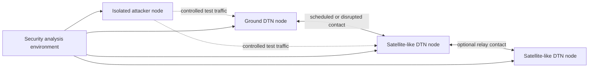

# Provisional Architecture

This is a design hypothesis for planning, not the implemented state. No DTN node
or traffic path has been built yet.

## Candidate components

- **Ground DTN node:** Generates, receives, stores, and forwards test bundles.
- **Satellite-like DTN nodes:** Emulate constrained, delayed, or disrupted links.
- **Attacker node:** Produces only authorized test inputs inside the isolated lab.
- **Security analysis environment:** Debuggers, sanitizers, packet analysis,
  tracing, artifact collection, and experiment control.
- **ION-DTN:** Candidate BP implementation under study; version and deployment TBD.
- **BPv7:** Bundle format and processing baseline defined by RFC 9171.
- **BPSec:** Candidate integrity/confidentiality mechanisms defined by RFC 9172;
  actual ION support and configuration must be verified.
- **Experiment tooling:** Reproducible orchestration and measurement added only as
  required by selected experiments.

## Expected trust boundaries

Network ingress, node/application boundaries, persistent stores, administrative
interfaces, security-policy/key material, and host/container boundaries. These
must be refined against actual ION-DTN code and deployment.

## Not implemented

Topology, contact plans, containers, node configuration, security contexts,
instrumentation, and traffic generation are all TBD.
